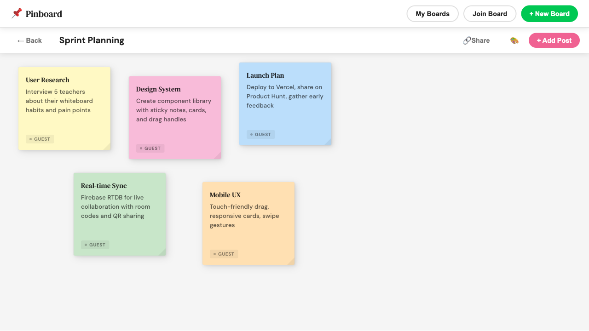
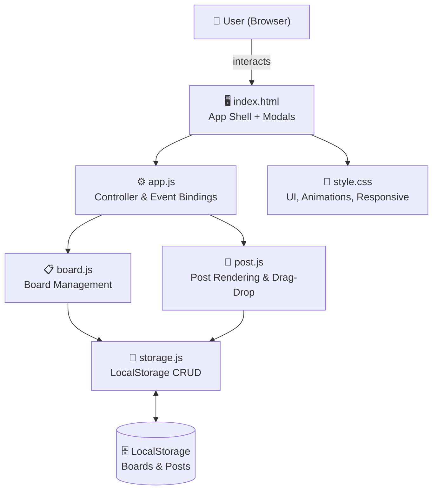

<div align="center">

# 📌 Pinboard

[](https://alfredang.github.io/pinboard/)
[](https://developer.mozilla.org/en-US/docs/Web/HTML)
[](https://developer.mozilla.org/en-US/docs/Web/CSS)
[](https://developer.mozilla.org/en-US/docs/Web/JavaScript)
[](LICENSE)
[](https://github.com/alfredang/pinboard/actions)

**A Padlet-inspired digital canvas for sticky notes, whiteboards, and collaborative activities.**

[Live Demo](https://alfredang.github.io/pinboard/) · [Report Bug](https://github.com/alfredang/pinboard/issues) · [Request Feature](https://github.com/alfredang/pinboard/issues)

</div>

---

## Screenshot

<!-- Add a screenshot of your app here -->
<!--  -->

> 🌐 **[Try it live →](https://alfredang.github.io/pinboard/)**

---

## About

**Pinboard** is a modern, lightweight clone of [Padlet](https://padlet.com) — a digital canvas that lets you post sticky notes, organize ideas, and build visual whiteboards. It runs entirely in the browser with **zero dependencies**, **no backend**, and **no build tools** required.

### ✨ Features

| Feature | Description |
|---------|-------------|
| 🗂 **Multiple Boards** | Create, name, and manage unlimited boards |
| 🖱 **Drag & Drop** | Freely move sticky notes around the canvas |
| 🎨 **Colorful Posts** | 7 pastel color options per sticky note |
| 👤 **Nicknamed Collaboration** | Guests join with a nickname to identify themselves |
| 🏷 **Post Authors** | New posts show the creator nickname on each card |
| 🖼 **Board Backgrounds** | Solid colors, dot grid, and line grid patterns |
| 📐 **3 Layout Modes** | Free (drag anywhere), Grid, and List |
| 💾 **Auto-Save** | All boards and posts persist via local storage |
| 📱 **Mobile Ready** | Touch drag-and-drop, fully responsive |
| ✏️ **Edit & Delete** | Update or remove any post at any time |
| 👁 **Board Previews** | Mini-preview cards on the home screen |

---

## Tech Stack


| Layer | Technology |
|-------|-----------|
| **Frontend** | HTML5, CSS3, Vanilla JavaScript (ES6+) |
| **Storage** | Browser LocalStorage API |
| **Layout** | CSS Grid, Flexbox |
| **Animations** | CSS Keyframes, Transitions |
| **CI/CD** | GitHub Actions |
| **Hosting** | GitHub Pages |

**Zero dependencies. No frameworks. No build step.**

---

## Architecture



---

## Project Structure

```
pinboard/
├── index.html                  # App shell, modals, toolbar
├── css/
│   └── style.css               # All UI styles, animations, responsive
├── js/
│   ├── storage.js              # LocalStorage CRUD helpers
│   ├── board.js                # Board creation, rendering, management
│   ├── post.js                 # Post creation, drag-and-drop, rendering
│   └── app.js                  # Main controller, event bindings
├── .github/
│   └── workflows/
│       └── deploy.yml          # GitHub Actions → GitHub Pages CI/CD
├── README.md
└── LICENSE
```

---

## Getting Started

### Prerequisites

- Any modern web browser (Chrome, Firefox, Safari, Edge)
- Git (for cloning)
- Optional: `python3` or any static file server for local dev

### Installation

```bash
# 1. Clone the repository
git clone https://github.com/alfredang/pinboard.git
cd pinboard

# 2. Open directly in browser
open index.html

# OR serve locally
python3 -m http.server 8080
# Then visit http://localhost:8080
```

No `npm install`. No `.env`. Just open and go.

---

## Usage

1. **Create a board** — Click **"Make a board"** or **"+ New Board"**
2. **Choose a layout** — Free (drag anywhere), Grid, or List
3. **Join with nickname** — Enter your nickname + 6-digit room code to join shared boards
4. **Add posts** — Click **"+ Add Post"**, write content, pick a color
5. **See authors** — Each new post card displays `by <nickname>`
6. **Drag posts** — Click and drag any post to reposition (Free layout)
7. **Edit posts** — Hover a post → click ✏️ Edit
8. **Change background** — Click 🎨 in the board toolbar

---

## Deployment

### GitHub Pages (current)

Automatically deploys via GitHub Actions on every push to `main`.

```yaml
# .github/workflows/deploy.yml
on:
  push:
    branches: [main]
```

### Self-hosted / Docker

```dockerfile
# Simple nginx serve
FROM nginx:alpine
COPY . /usr/share/nginx/html
EXPOSE 80
```

```bash
docker build -t pinboard .
docker run -p 8080:80 pinboard
# Visit http://localhost:8080
```

### Any Static Host

Upload the entire repo folder to:
- **Netlify** — drag & drop the folder
- **Vercel** — `vercel deploy`
- **Cloudflare Pages** — connect the repo

---

## Contributing

Contributions are welcome!

1. Fork the repository
2. Create your feature branch: `git checkout -b feature/your-feature`
3. Commit your changes: `git commit -m 'feat: add your feature'`
4. Push to the branch: `git push origin feature/your-feature`
5. Open a Pull Request

---

## License

This project is licensed under the MIT License — see the [LICENSE](LICENSE) file for details.

---

## Acknowledgements

- Inspired by [Padlet](https://padlet.com) — the original digital canvas
- Built with ❤️ using [OpenClaw](https://openclaw.ai) — AI-powered personal agent platform
- Deployed via [GitHub Pages](https://pages.github.com/)

<div align="center">

⭐ **Star this repo if you found it useful!**

Built with [OpenClaw](https://openclaw.ai)

</div>
